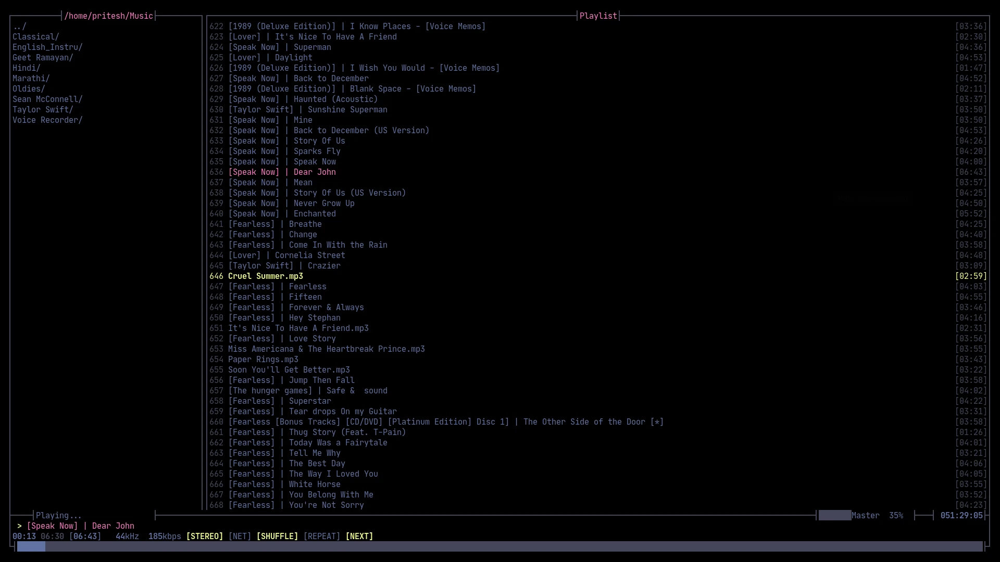
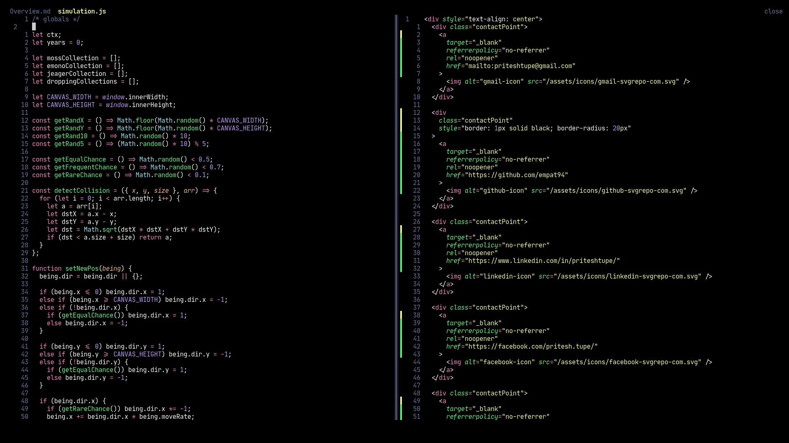
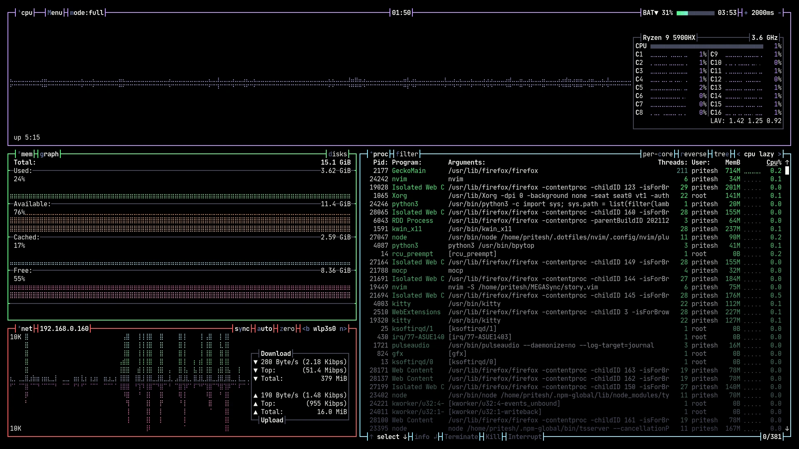

 
<h1 align="center"> .DOTFILES </h1>
 

## Intro

I use [GNU Stow](https://www.gnu.org/software/stow/) to manage my dotfiles. A nice article on same by [stevenrbaker](https://www.stevenrbaker.com/tech/managing-dotfiles-with-gnu-stow.html). Another good article by [alexpearce](https://alexpearce.me/2016/02/managing-dotfiles-with-stow/)

## Usage

1. Clone the repository `git clone --depth=1 https://github.com/EMPAT94/dotfiles.git ~/.dotfiles`

2. Cd into the dir `cd ~/.dotfiles`

3. Dry-run on a app, eg firefox `stow --verbose --no firefox`

4. Live-run on a app, eg nvim `stow --verbose nvim`

5. Verify that symlinks were made `ls -lah ~/.config/nvim` should show `/home/<user>/.config/nvim -> ../.dotfiles/nvim/.config/nvim`

## Notes

As you can see, I use [dracula](https://draculatheme.com/) theme for most of my apps, focusing on minimalist UI with a high contrast ratio and poppy colors.

I'd recommend going through the files and cherry-picking the stuff you want to include instead of wholesale copy-paste, this means you don't get surprise changes and can tweak to your liking.

Programs I use -

1. [kitty terminal](https://sw.kovidgoyal.net/kitty/)
1. [zsh shell](https://en.wikipedia.org/wiki/Z_shell)
1. [firefox web browser](https://www.mozilla.org/en-US/firefox/new/)
1. [mocp - music on console player](https://moc.daper.net/)
1. [neovim text editor](https://neovim.io/)
1. [bpytop system monitor](https://github.com/aristocratos/bpytop)

I use this setup on a Manjaro KDE machine.

## Screenshots

* mocp:

* neovim:

* bpytop:

